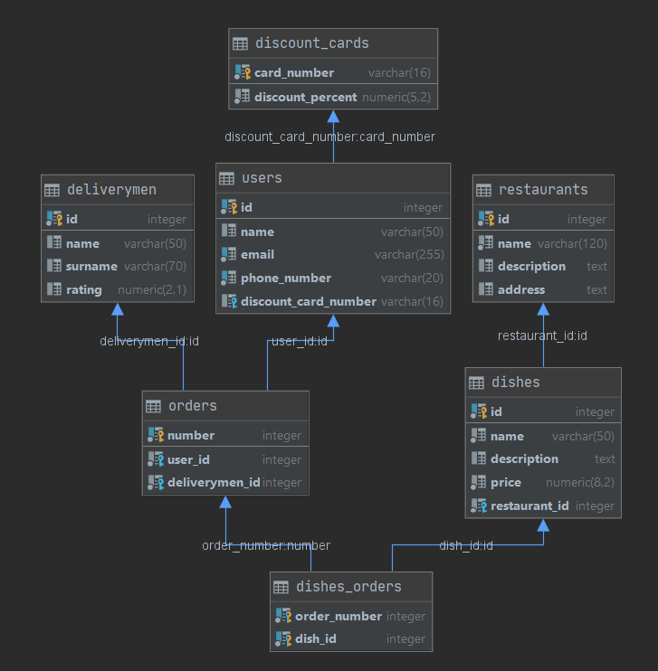
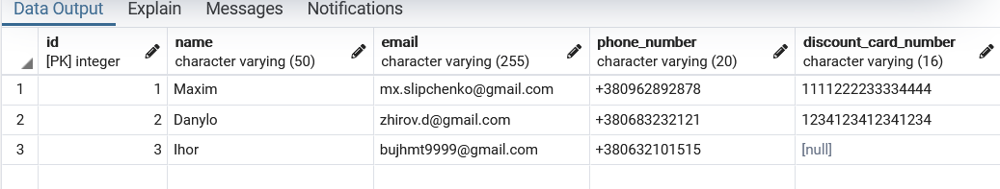
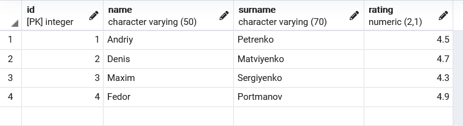
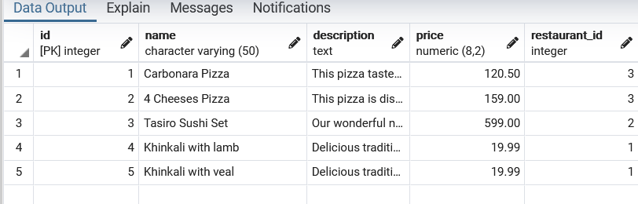

# Лабораторна робота №1
## Проектування бази даних та ознайомлення з базовими операціями СУБД PostgreSQL

_Варіант 5_

#### Розроблена модель: 

#### Структура БД:

#### Приклади таблиць:

 - Таблиця Users:
 
 
 - Таблиця Deliverymen:
 
 
 - Таблиця Dishes:
 
 
